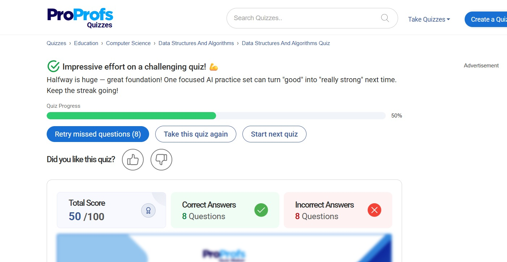

# Module 2 Quiz

## Data Structures and Algorithms Quiz

This quiz was completed as part of Cognizant DeepSkilling Module 2.

### Result Summary

- Score: 50/100
- Correct Answers: 8
- Incorrect Answers: 8

### Learning Reflection

The quiz helped reinforce concepts related to:

- Analysis of Algorithms
- Time Complexity
- Sorting Algorithms
- Arrays
- Linked Lists
- Searching Algorithms

Based on the results, I identified areas that require further practice and revision to improve problem-solving and algorithm analysis skills.

### Proof

